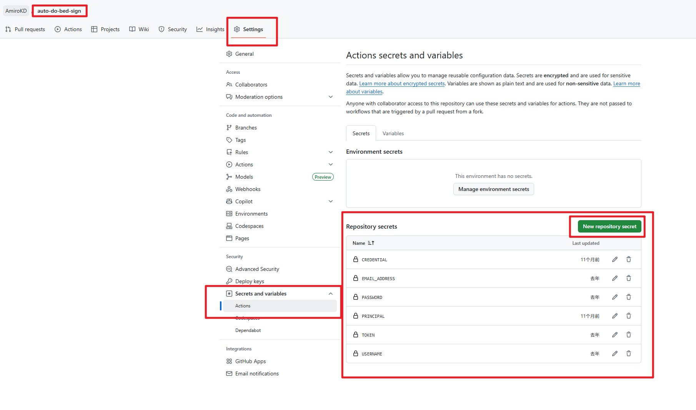
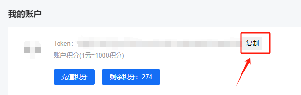
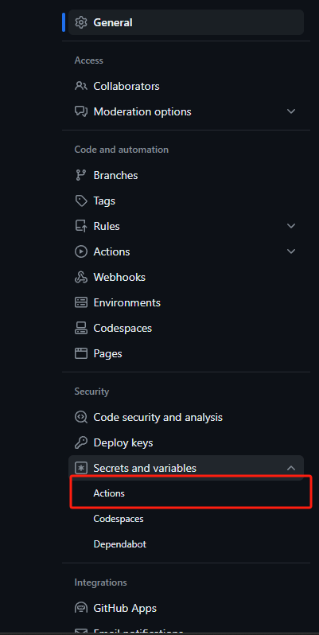
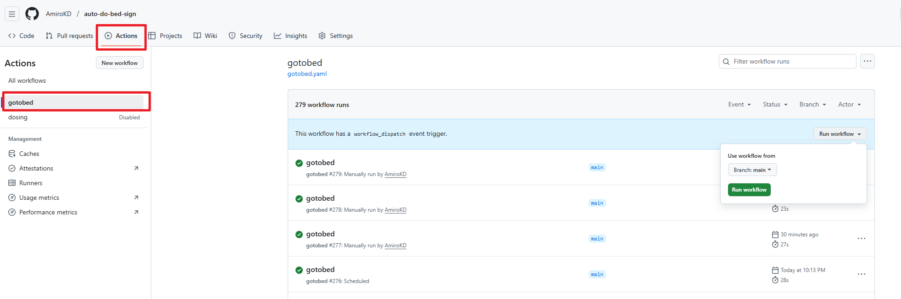
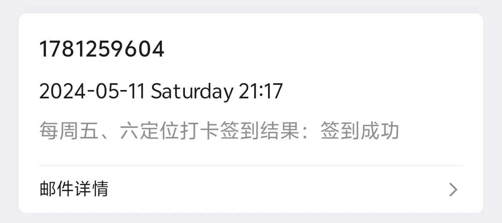
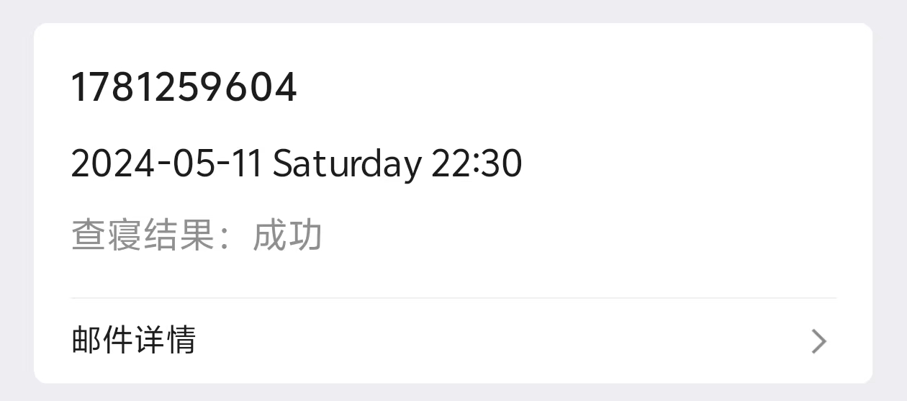

>
>**[doSignIn AND goToBed](#dosignin-and-gotobed)**

# auto-do-bed-sign

> **当前版本：v1.2**  
> 📢 **更新说明 (v1.2)**：验证码识别方式已从第三方打码平台更换为本地 `ddddocr` 模块。无需再配置打码平台的 TOKEN 和积分。

### 简介
这是一个自动签到和查寝的工具。

- `doSignIn` 对应签到任务
- `gotobed` 对应查寝任务
- 若不需要某个时间段的任务，可直接注释掉对应的 yaml 文件。
- 定时任务时间修改请在 `.github/workflows/doSignIn.yaml` 或 `.github/workflows/gotobed.yaml` 中进行。
- 如果使用 QQ 邮箱接收结果，第一次请检查是否被误判为垃圾邮件，若是，请将其标记为非垃圾邮件。

---

## ⚙️ 变量配置
变量需要在仓库的 `Settings` -> `Secrets and variables` -> `Actions` 中配置。

### [学工平台](https://ids.gzist.edu.cn/lyuapServer/login)
首先进入学工平台，点击登录，找到账号密码登录。



### 必需的 Repository Secrets
无添加顺序要求，需将以下参数逐个添加：

```env
USERNAME      # 学工平台的账号
PASSWORD      # 学工平台的密码
EMAIL_ADDRESS # 结果发送接收邮箱地址
```

> ~~`TOKEN` # 云码平台密钥（v1.2 起已弃用，无需配置）~~

**如果出现二次验证情况**，还需要在学工系统 -> 安全中心 -> 密保 中配置以下两个变量：
```env
PRINCIPAL     # 密保问题
CREDENTIAL    # 密保答案
```


---

## ~~🤖 自动打码平台（已弃用）~~
~~[云码 注册地址](https://console.jfbym.com/register/TG66434)（免费300积分）~~
> v1.2 已全面转为本地 `ddddocr`，不需要再注册云码平台。

---

## 📖 具体使用教程

1. **Fork 仓库**  
   先将本项目 Fork 到你的个人账号下。
   

2. **配置 Secrets 变量**  
   在仓库的 `Settings` --> `Secrets and variables` --> `Actions` 中配置上述变量。
   
   

3. **配置定时任务**  
   按照需要在 `.github/workflows` 目录下修改定时任务的触发时间。

4. **查看运行情况**  
   配置成功后，在仓库的 `Actions` 选项卡中查看自动运行情况。
   

### 效果图
  

